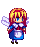
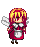
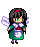
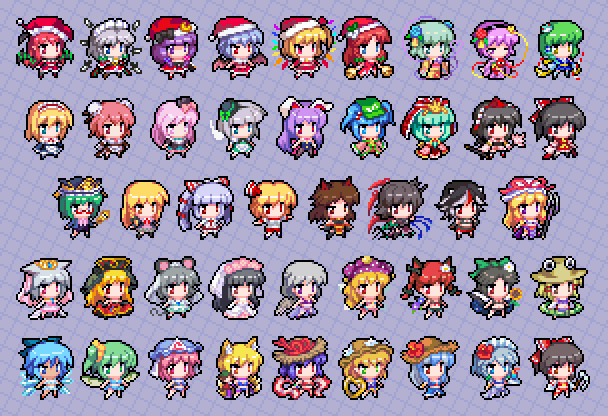
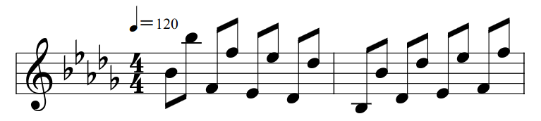

#  CSCB58 Assembly Project: The Doll Maker of Bucuresti
> for CSCB58 Winter 2023, University of Toronto, Scarborough

## Information

The Doll Maker of Bucuresti is a platform game built in MIPS assembly.

Here are the opening and ending menus:

| OP | ED |
|:-:|:-:|
|||

A walkthrough of this game can be found [here](https://youtu.be/EOQPEltkxjo) (YouTube):

## Runnning on MARS
> Acquire the JAR [here](https://courses.missouristate.edu/KenVollmar/MARS/download.htm).

- open MARS
- create an empty file `game.asm` and open it in MARS
- copy [game.asm](./game.asm) in this repo to the empty file with an external editer/CLI tool
  - this avoids MARS rendering the code in its editer
  - equivalently, cut all the content from game.asm, open it in MARS, then paste it back
- in MARS, under Tools
  - open Keyboard and Display MMIO Simulator
  - open Bitmap Display and [configure](#bitmap-display-configuration) it
- assemble, then run

### Bitmap Display Configuration

- Unit Width in Pixels: 4
- Unit Height in Pixels: 4
- Display Width in Pixels: 512
- Display Height in Pixels: 512
- Base address for display: 0x10008000 ($gp)

## Features

> tl;dr milestone 3 option CGJKLM as per [handout](./handout.pdf)

### User Interface
> start and end menu

- transitions
- BGM (see [Music](#music))
- button animation (see [demo](#demostration))

### Gameplay
> 4 stages

- animated player and pickups
- different pickup effects per stage
  - gravity changes
  - platform apprears
  - player teleports

### Progammer's Note
> some interesting remarks about the code

- Although the code is somewhere below 8000 lines, it contains actually ~350 000 lines of instructions after macro expansion by the assembler.
- Some Python [scripts](./scripts/) were developed to hardcode the animated sprites, UI components, and screen transitions.
- Character movement is optimised such that only one row/column is erased during movement. For instance, moving up would redraw the player and erase only the bottom row.
- Key presses in the opening and ending menus are handled by the same code, but since it isn't really meaningful to have restart option during the opening, I didn't include the UI for the P button.
- UI components are reused. For example, the program draws `re`, `start` and `turn` to construct `start`, `restart` and `return`.
- Animations are stored as an array of labels, which can be used with `jalr` and some functional programming.

## Assets and Inspiration

tl;dr I used these

(first character on the second row)

The [art](./assets/alice.png) in the opening, the [dolls](./assets/pickups/) as pickups during gameplay, and the animated [doll](./assets/postgame/) in the ending all come from pixels art in [here](http://forest.her.jp/moricchi/dot.htm) (JP). Although the website was last updated in 2016, the author says they are free to use [whatsoever](http://forest.her.jp/cgi-bin/imagedot/dat/skin/pi03f_blue/index.html) (JP).

The character during gameplay is drawn with [this image](https://mi-keito.tumblr.com/image/166035811580) (Tumblr) as a reference. I downscaled the image and animated myself.

All other assets are handmade by myself, including the UI components, transitions, etc. Some [maths](./docs/math.md) was involved.

This project is also inspired by Stephen's [B58 project](https://github.com/Epicsteve2/CSCB58_Project) in Winter 2021, which was also a reference to Touhou 8. This project uses themes from Touhou 5 and 10 (see [Music](#mulic)), and the playable character is from the Touhou character, Alice Margatroid, who appeared in Touhou 5, 7, 8 and 11 ([wiki](https://en.touhouwiki.net/wiki/Alice_Margatroid)).

## Music
> everything is Touhou

### Game Title

The title, "The Doll Maker of Bucuresti," is the stage 3 theme in Touhou 7 right before Alice's boss fight. I feel this theme doesn't quite fit for a simple and casual platform game, so I didn't include it in the gameplay.

- [Wiki](https://en.touhouwiki.net/wiki/Perfect_Cherry_Blossom/Music#Stage_3_theme) about this theme
- OST: [YouTube](https://youtu.be/XzNO7Z9sjsI) (JP) and [YouTube](https://youtu.be/NVhtS5cjAv0) (EN)

### Opening

The opening uses a piano arrangement of "Alice in Wonderland", which is the extra stage theme in Touhou 5. As the name of the theme suggests, it is inspired by the novel Alice's Adventures in Wonderland.

- [Wiki](https://en.touhouwiki.net/wiki/Mystic_Square/Music#Extra_Stage_theme)
- OST: [YouTube](https://youtu.be/n0jbvJjTXPw) (EN), and [YouTube](https://youtu.be/UkK2Dg8kB1I) (JP)
- piano arrangement by DMBN: [YouTube](https://youtu.be/ib3RR_QpFzo) (JP)
- full version in recorded in the game: [YouTube](https://youtu.be/iSI5jA82-i8)

### Ending

The ending theme comes from "Player Score" in Touhou 10 as it's game over theme as well. The theme itself is simply this on repeat:

- [Wiki](https://en.touhouwiki.net/wiki/Mountain_of_Faith/Music#Score_theme)
- OST: [YouTube](https://youtu.be/hnF2T47_iW0) (JP)
- piano arrangement by DMBN: [YouTube](https://youtu.be/pbjyyJdeyS8) (JP)