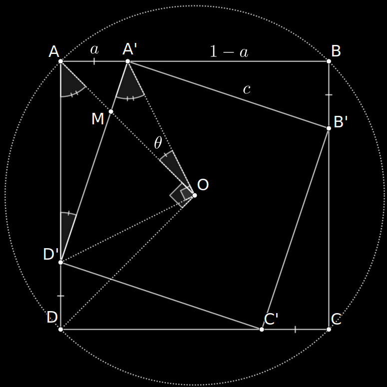
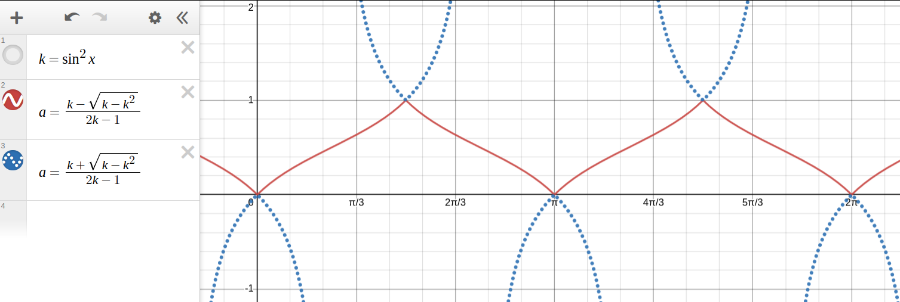
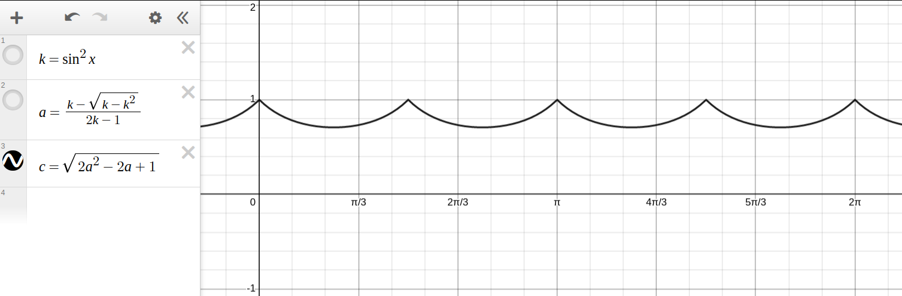

Consider a square $ABCD$ of side length $1$, and a smaller square $A'B'C'D'$ which is inscribed inside $ABCD$ with a rotation of $\theta$. We want to find the side length of the inscribed square. Let's first consider the following figure:

First, we have $\angle A'OD'=\angle AOD=\pi/4$ since $\triangle AOD$ and $\triangle A'OD'$ are isosceles right triangles. In addition to the fact that $\angle AMD'=\angle A'MO$ as $M$ is an intersection of two lines, we can conclude that $\angle AD'A'=\angle AOA'=\theta$ because $AMD'\sim A'MO$. Then, since $\triangle AD'A'$ is an right triangle and $A'D'=c$, we have $a=c\sin\theta$.

Secondly, as $c$ is the length of the hypotenuse of the right triangle $AD'A'$, we have $c^2=a^2+(1-a)^2$. Therefore, we will use these equations to solve for $a$ in terms of $\theta$, then the side length of the inscribed square is $c=\sqrt{2a^2-2a+1}$.

$$
\begin{align*}
  c^2&=a^2+(1-a)^2=2a^2-2a+1\tag{1}\\
  a^2&=c^2\sin^2\theta\tag{2}
\end{align*}
$$

Let $k=\sin^2\theta$ for simplicity.

$$
\begin{align*}
  \therefore&&a^2&=(2a^2-2a+1)k=2ka^2-2ka+k\\
  \therefore&&0&=(2k-1)a^2-2ka+k\\
  \therefore&&a&=\frac{2k\pm\sqrt{4k^2-4(2k-1)k}}{2(2k-1)}=\frac{k\pm\sqrt{k-k^2}}{2k-1}\\
\end{align*}
$$

Based the figure, we have $0\le a\le 1$. Therefore:

$$
a=\frac{k-\sqrt{k-k^2}}{2k-1}
$$

which can be visualised by this graph:

And finally, we get $c=\sqrt{a^2+(1-a)^2}=\sqrt{2a^2-2a+1}$, which is this graph:

Using the formula, we can iteratively generate rotated inscribed squares to create a sprial effect. For example, this is generated with $\theta=\pi/24$ on 24 iterations.

